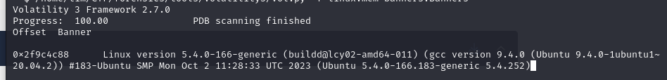
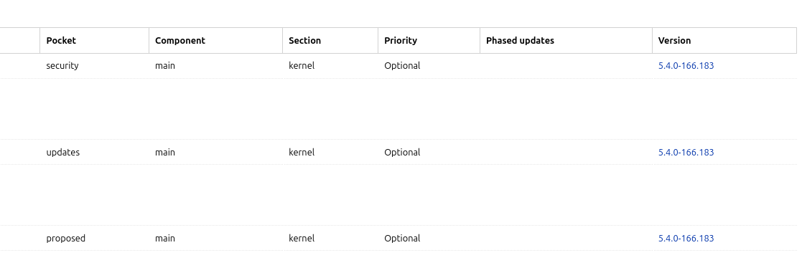
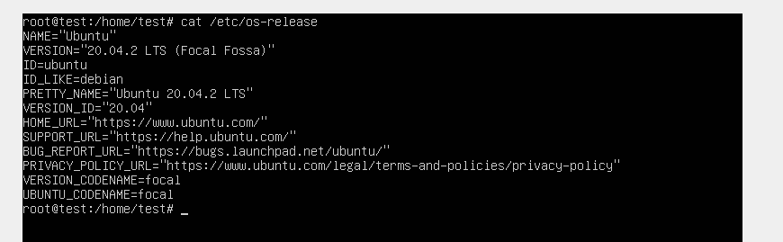
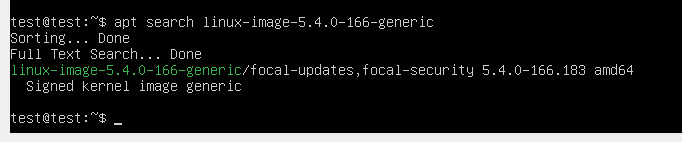
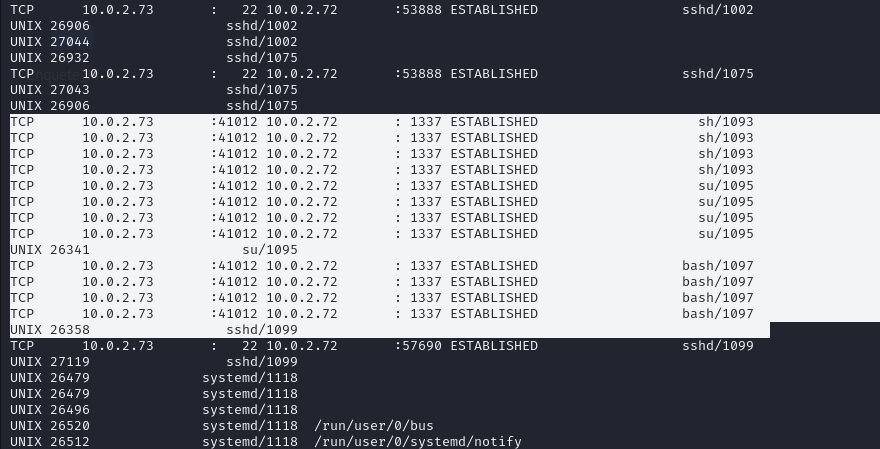

# Write-up challenge Profiles - TryHackMe

## Category :
    Forensics

## Link :
    https://tryhackme.com/r/room/profilesroom

## Description :

    The incident response team has alerted you that there was some suspicious activity on one of the Linux database servers.

    A memory dump of the server was taken and provided to you for analysis. You advise the team that you are missing crucial information from the server, but it has already been taken offline. They just made your job a little harder, but not impossible.

    Click on the Download Task Files button at the top of this task. You will be provided with an evidence.zip file.
    Extract the zip file's contents and begin your analysis in order to answer the questions.

    Note: The challenge is best done using your own environment. I recommend using Volatility 2.6.1 to handle this task and strongly advise using this article by Sean Whalen to aid you with the Volatility installation.

## Data given :
    2c5adbf7116c3feeb6bd8af7dfa1f6c5  evidence-1699332676548.zip

## Solution :

### We are faced with a RAM dump of a Linux server, so we are going to identify which OS and which Kernel the server was using :
    /home/tim/CTF/forensics/tools/volatility3/vol.py -f linux.mem banners.Banners

### We then know :
    - Kernel : 5.4.0-166-generic
    - OS : Ubuntu 20.04.2

### We start by downloading the right ISO image, in this case an Ubuntu Server 20.04.2 :
    http://old-releases.ubuntu.com/releases/20.04.2/ubuntu-20.04.2-live-server-amd64.iso

### Now we can start looking for the kernel image we want and the dbgsymbol we need to create the Volatility profile :
    - dbgsym : https://bugs.launchpad.net/ubuntu/focal/amd64/linux-image-5.4.0-166-generic-dbgsym/5.4.0-166.183
    - kernel : https://bugs.launchpad.net/ubuntu/focal/amd64/linux-image-5.4.0-166-generic
  
### To install the kernel, add the following to the source lists :

    miroir-ubuntu focal security main

### We then mount the ISO on a VM created via VirtualBox and remove its network card to avoid downloading unwanted updates : 

### We check that we have the right version of Ubuntu :

### We can then download the image of the kernel we're interested in :

### Check that the kernel is being used :

### We then add the correct source list to download the debug symbols :

    deb http://ddebs.ubuntu.com focal main restricted universe multiverse
    deb http://ddebs.ubuntu.com focal-updates main restricted universe multiverse
    deb http://ddebs.ubuntu.com focal-proposed main restricted universe multiverse

### We add the GPG keys : 

    wget -O - http://ddebs.ubuntu.com/dbgsym-release-key.asc | sudo apt-key add -

### Then install the kernel debug symbols :
    sudo apt update -y && sudo apt install linux-image-5.4.0-166-generic-dbgsym

## Creating a Volatility3 profile :

### We start by downloading the necessary packages :
    apt update -y && apt install -y git golang-1.18-go

### If you can't install Golang with the Ubuntu mirrors :
    [ ! -d "/usr/local/go" ] && cd /tmp && wget https://go.dev/dl/go1.18.linux-amd64.tar.gz && tar -C /usr/local/ -xzf go1.18.linux-amd64.tar.gz && cd /usr/local/ && echo "export PATH=\$PATH:/usr/local/go/bin:\$HOME/go/bin" >> ~/.bashrc && echo "export GOROOT=/usr/local/go" >> ~/.bashrc && echo "export PATH=\$PATH:/usr/local/go/bin:\$HOME/go/bin" >> /home/*/.bashrc && echo "export GOROOT=/usr/local/go" >> /home/*/.bashrc && source ~/.bashrc && source /home/*/.bashrc

### We can also download the pre-compiled binary of dwarf2json if we don't have Golang installed in the right version :
    wget https://github.com/volatilityfoundation/dwarf2json/releases/download/v0.8.0/dwarf2json-linux-amd64

### We follow the procedure :
    - git clone https://github.com/volatilityfoundation/dwarf2json.git
    - cd dwarf2json.git
    - go build
    - sudo ./dwarf2json linux --elf /usr/lib/debug/boot/vmlinux-5.4.0-166-generic --system-map /boot/System.map-5.4.0-166-generic > Ubuntu20.04.2-5.4.0-166-generic.json 

### We can now add the new profile to our Volatility3 repository :
    mv Ubuntu20.04.2-5.4.0-166-generic.json volatility3/symbols/linux/

## Create a Volatlility2 profile :

### We download the right linux headers :
    sudo apt install linux-headers-5.4.0-166-generic

### Retrieve the Volatility repo :
    git clone https://github.com/volatilityfoundation/volatility && cd volatility/tools/linux

### Then build the tool  :
    sudo make -C /lib/modules/5.4.0-166-generic/build/ CONFIG_DEBUG_INFO=y M=$PWD modules

### Download dwarfdump and zip :
    sudo apt install dwarfdump zip

### We continue :
    - dwarfdump -di ./module.o > module.dwarf
    - sudo zip Ubuntu64-5.4.0.166.zip module.dwarf /boot/System.map-5.4.0-166-generic
  
### We can now add our new volatility2 profile to our Volatility directory :
    cp Ubuntu64-5.4.0.166.zip volatility/plugins/overlays/linux/

## Answers :

### What is the exposed root password ? 
    python2 volatility/vol.py --profile=LinuxUbuntu20_04_2_166x64 -f linux.mem linux_bash

### And what time was the users.db file approximately accessed? Format is YYYY-MM-DD HH:MM:SS : 
    python2 volatility/vol.py --profile=LinuxUbuntu20_04_2_166x64 -f linux.mem linux_bash

### What is the MD5 hash of the malicious file found ?
 
### To answer this question, we need to identify which binary is malicious. By looking at the Bash history, we can see that the attacker filed a code named shell.c and then compiled it under the name pkexecc :

### We then look for the Inode of the binary to be able to retrieve it :
    python2 volatility/vol.py --profile=LinuxUbuntu20_04_2_166x64 -f linux.mem linux_find_file -F "/home/paco/pkexecc"

### It can then be retrieved using the same volatility command :
    python2 volatility/vol.py --profile=LinuxUbuntu20_04_2_166x64 -f linux.mem linux_find_file -i 0xffff8903b2364120 -O pkexecc

### We can now utilize the 'md5sum' command to calculate the hash of the binary :
    md5sum pkexecc

### What is the IP address and port of the malicious actor? Format is IP:Port 
    python2 volatility/vol.py --profile=LinuxUbuntu20_04_2_166x64 -f linux.mem linux_netstat

### What is the full path of the cronjob file and its inode number? Format is filename:inode number
### We start by getting a list of all the files in RAM :

    python2 volatility/vol.py --profile=LinuxUbuntu20_04_2_166x64 -f linux.mem linux_enumerate_files > enumerate

### We then look for the 'cron' recurrence in our new file :
    cat enumerate |grep cron

### We find :

### What we're interested in is the crontab added as root since the attacker was acting as root. We therefore retrieve the information :
    /var/spool/cron/crontabs/root 131127 0xffff8903b23667a8

### What command is found inside the cronjob file ?
    python2 volatility/vol.py --profile=LinuxUbuntu20_04_2_166x64 -f linux.mem linux_find_file -i 0xffff8903b23667a8  -O cron && cat cron
