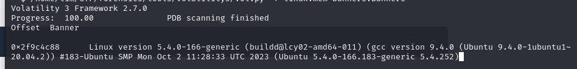
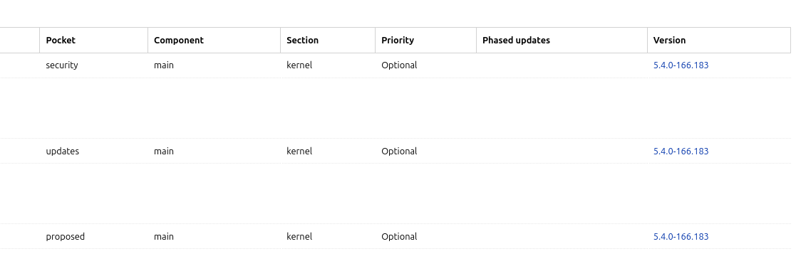
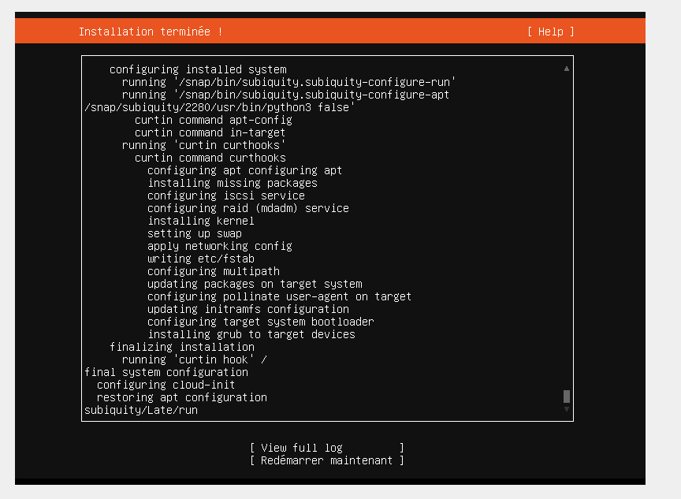
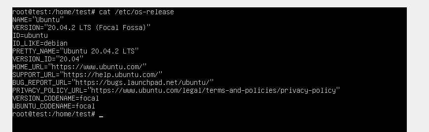
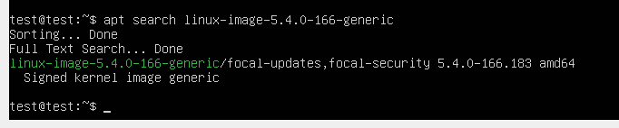
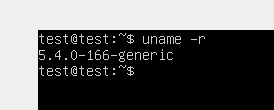
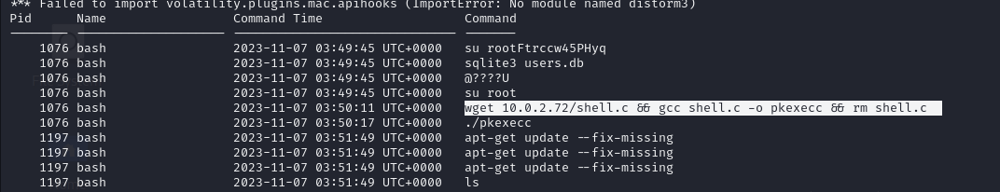
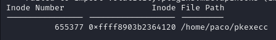
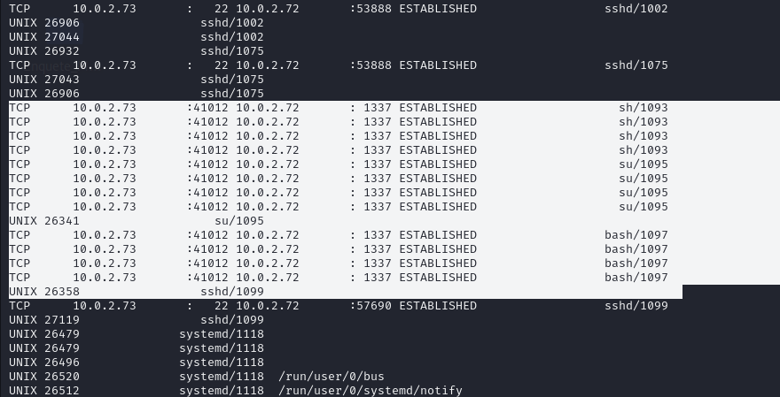
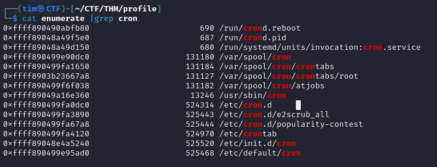

# Write-up challenge Profiles - TryHackMe

## Catégorie :
    Forensics

## Lien :
    https://tryhackme.com/r/room/profilesroom

## Description :

    The incident response team has alerted you that there was some suspicious activity on one of the Linux database servers.

    A memory dump of the server was taken and provided to you for analysis. You advise the team that you are missing crucial information from the server, but it has already been taken offline. They just made your job a little harder, but not impossible.

    Click on the Download Task Files button at the top of this task. You will be provided with an evidence.zip file.
    Extract the zip file's contents and begin your analysis in order to answer the questions.

    Note: The challenge is best done using your own environment. I recommend using Volatility 2.6.1 to handle this task and strongly advise using this article by Sean Whalen to aid you with the Volatility installation.

## Données exploitables :
    2c5adbf7116c3feeb6bd8af7dfa1f6c5  evidence-1699332676548.zip

## Solution :

### On se retrouve face à un dump de RAM d'un serveur Linux, on va donc identifier quel OS et quel Kernel le serveur utilisait :
    /home/tim/CTF/forensics/tools/volatility3/vol.py -f linux.mem banners.Banners

### On sait alors :
    - Kernel : 5.4.0-166-generic
    - OS : Ubuntu 20.04.2

### On commence alors par télécharger l'image ISO qui nous intéresse, ici un Ubuntu Server 20.04.2 :
    http://old-releases.ubuntu.com/releases/20.04.2/ubuntu-20.04.2-live-server-amd64.iso

### On peut commencer à chercher l'image kernel qui nous intéresse ainsi que les dbgsymbol qui nous serons nécessaires pour la création du profil Volatility :
    - dbgsym : https://bugs.launchpad.net/ubuntu/focal/amd64/linux-image-5.4.0-166-generic-dbgsym/5.4.0-166.183
    - kernel : https://bugs.launchpad.net/ubuntu/focal/amd64/linux-image-5.4.0-166-generic
  
### Pour l'installation du kernel, on note qu'il faudra rajouter dans les sources lists :

    miroir-ubuntu focal security main

### On monte alors l'ISO sur une VM créé via VirtualBox puis on enlève sa carte réseau pour ne pas télécharger de mises à jours non désirées : 

### On vérifie que nous avons bien la bonne version d'Ubuntu :

### On peut alors télécharger l'image du kernel qui nous intéresse :

### On vérifie que le kernel est bien utilisé :

### On rajoute alors les bonnes sources list pour télécharger les symboles de debug :

    deb http://ddebs.ubuntu.com focal main restricted universe multiverse
    deb http://ddebs.ubuntu.com focal-updates main restricted universe multiverse
    deb http://ddebs.ubuntu.com focal-proposed main restricted universe multiverse

### On rajoute les clés GPG : 

    wget -O - http://ddebs.ubuntu.com/dbgsym-release-key.asc | sudo apt-key add -

### On installe alors les symboles de debug du kernel :
    sudo apt update -y && sudo apt install linux-image-5.4.0-166-generic-dbgsym

## Création profil Volatility 3 :

### On commence par installer les packages nécessaires :
    apt update -y && apt install -y git golang-1.18-go

### Pour l'installation de Golang si pas trouvé dans les miroirs :
    [ ! -d "/usr/local/go" ] && cd /tmp && wget https://go.dev/dl/go1.18.linux-amd64.tar.gz && tar -C /usr/local/ -xzf go1.18.linux-amd64.tar.gz && cd /usr/local/ && echo "export PATH=\$PATH:/usr/local/go/bin:\$HOME/go/bin" >> ~/.bashrc && echo "export GOROOT=/usr/local/go" >> ~/.bashrc && echo "export PATH=\$PATH:/usr/local/go/bin:\$HOME/go/bin" >> /home/*/.bashrc && echo "export GOROOT=/usr/local/go" >> /home/*/.bashrc && source ~/.bashrc && source /home/*/.bashrc

### On peut également utiliser la version pré-compilé de dwarf2json :
    wget https://github.com/volatilityfoundation/dwarf2json/releases/download/v0.8.0/dwarf2json-linux-amd64

### On suit la procédure :
    - git clone https://github.com/volatilityfoundation/dwarf2json.git
    - cd dwarf2json.git
    - go build
    - sudo ./dwarf2json linux --elf /usr/lib/debug/boot/vmlinux-5.4.0-166-generic --system-map /boot/System.map-5.4.0-166-generic > Ubuntu20.04.2-5.4.0-166-generic.json 

### On peut alors rajouter le nouveau profile à Volatility3 :
    mv Ubuntu20.04.2-5.4.0-166-generic.json volatility3/symbols/linux/

## Création profil Volatility 2 :

### On télécharge les headers requis :
    sudo apt install linux-headers-5.4.0-166-generic

### On récupère le git :
    git clone https://github.com/volatilityfoundation/volatility && cd volatility/tools/linux

### On build ensuite l'outil :
    sudo make -C /lib/modules/5.4.0-166-generic/build/ CONFIG_DEBUG_INFO=y M=$PWD modules

### On télécharge dwarfdump et zip :
    sudo apt install dwarfdump zip

### On continue :
    - dwarfdump -di ./module.o > module.dwarf
    - sudo zip Ubuntu64-5.4.0.166.zip module.dwarf /boot/System.map-5.4.0-166-generic
  
### On peut le mettre dans notre Volatility2 par la suite :
    cp Ubuntu64-5.4.0.166.zip volatility/plugins/overlays/linux/

## Réponses :

### What is the exposed root password ? 
    python2 volatility/vol.py --profile=LinuxUbuntu20_04_2_166x64 -f linux.mem linux_bash

### And what time was the users.db file approximately accessed? Format is YYYY-MM-DD HH:MM:SS : 
    python2 volatility/vol.py --profile=LinuxUbuntu20_04_2_166x64 -f linux.mem linux_bash

### What is the MD5 hash of the malicious file found ?

### Pour répondre, il faut identifier quel binaire est malicieux. En regardant l'historique Bash, on voit que l'attaquant a déposé un code nommé shell.c et qu'il a ensuite compilé sous le nom pkexecc :

### On cherche alors l'Inode du binaire pour pouvoir le récupérer :
    python2 volatility/vol.py --profile=LinuxUbuntu20_04_2_166x64 -f linux.mem linux_find_file -F "/home/paco/pkexecc"

### On peut ensuite le récupérer avec la même commande volatility :
    python2 volatility/vol.py --profile=LinuxUbuntu20_04_2_166x64 -f linux.mem linux_find_file -i 0xffff8903b2364120 -O pkexecc

### On peut alors utiliser la commande md5sum pour calculer son condensat :
    md5sum pkexecc

### What is the IP address and port of the malicious actor? Format is IP:Port 
### Commande : 
    python2 volatility/vol.py --profile=LinuxUbuntu20_04_2_166x64 -f linux.mem linux_netstat

### What is the full path of the cronjob file and its inode number? Format is filename:inode number

### On commence par récupérer la liste de tout les fichiers répertoriés dans la RAM :

    python2 volatility/vol.py --profile=LinuxUbuntu20_04_2_166x64 -f linux.mem linux_enumerate_files > enumerate

### On cherche ensuite la récurrence de 'cron' dans notre nouveau fichier :
    cat enumerate |grep cron

### On trouve alors :

### Ce qui nous intéresse est donc la crontab rajoutée en tant que root puisque l'attaquant agissait sous ce compte. On récupère donc les informations :
    /var/spool/cron/crontabs/root 131127 0xffff8903b23667a8

### What command is found inside the cronjob file ?
### Commande : 
    python2 volatility/vol.py --profile=LinuxUbuntu20_04_2_166x64 -f linux.mem linux_find_file -i 0xffff8903b23667a8  -O cron && cat cron
